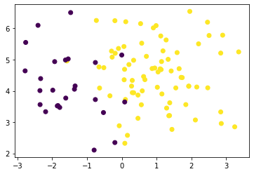
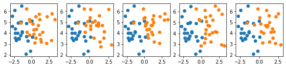

# Dealing with Imbalanced Datasets


```python
from sklearn.datasets import make_blobs
import matplotlib.pyplot as plt
import numpy as np
```


```python
minority_ratio = 1/4
n_samples = 100
n_features = 2

# Define labels for minority and majority class
minority_class = 0
majority_class = 1

X = np.zeros((n_samples, n_features))
y = np.zeros(n_samples)

# Generate two imbalanced blobs
k = int(n_samples * (1-minority_ratio))
X[:k, :], _ = make_blobs(k, n_features, 1, random_state=0)
y[:k] = minority_class

X[k:, :], _ = make_blobs(n_samples-k, n_features, 1, random_state=1)
y[:k] = majority_class
```


```python
plt.scatter(*X.T, c=y)
```


    <matplotlib.collections.PathCollection at 0x1253de790>





```python
def sample_randomly(X, y, n):
    """ Randomly sample n values from X and y without replacement """
    indices = np.random.choice(
        np.arange(0, X.shape[0]),
        size=n,
        replace=False
    )
    
    return X[indices], y[indices]
```

This is a test with latex equaiont $\sqrt(5) \exp^{a_t}$


```python
fig, axarr = plt.subplots(ncols=5, figsize=(10, 2))

# Select minority data
X_min, y_min = X[y == minority_class], y[y == minority_class]

for i, ax in enumerate(axarr):
    # Select and undersample majority data
    X_maj, y_maj = X[y == majority_class], y[y == majority_class]
    X_maj, y_maj = sample_randomly(X_maj, y_maj, X_min.shape[0])
    
    ax.scatter(*X_min.T)
    ax.scatter(*X_maj.T)
```





```python

```
