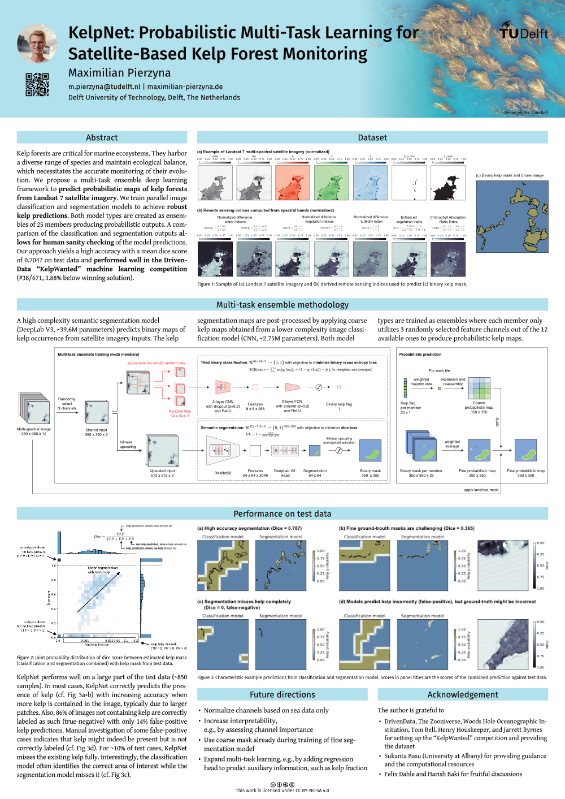

Kelp forests are critical for marine ecosystems. 
They harbor a diverse range of species and maintain ecological balance, which necessitates the accurate monitoring of their evolution. 
We propose a multi-task ensemble deep learning framework to predict probabilistic maps of kelp forests from Landsat 7 satellite imagery. 
We train parallel image classification and segmentation models to achieve robust kelp predictions. 
Both model types are created as ensembles of 25 members producing probabilistic outputs. 
A comparison of the classification and segmentation outputs allows for human sanity checking of the model predictions. 
Our approach yields a high accuracy with a mean dice score of 0.7047 on test data and performed well in the DrivenData "KelpWanted" machine learning competition (#38/671, 3.88% below winning solution).

_This work was an entry for the ["KelpWanted" DrivenData machine learning competition](https://www.drivendata.org/competitions/255/kelp-forest-segmentation/)
and was presented as a poster at the 2024 edition of the ESA-ECMWF Machine Learning for Earth System Observation and Prediction (ML4EOPS, https://www.ml4esop.esa.int) workshop._

## Poster

High-resolution version of poster: [pdf, 3MB](./KelpNet_rev2_online.pdf)
