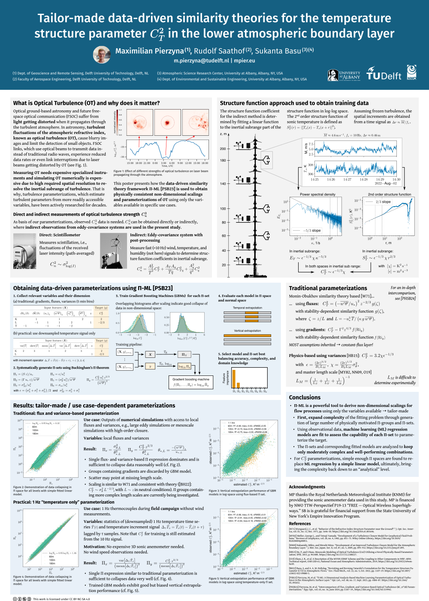

Optical ground-based astronomy and future free-space optical communication (FSOC) suffer from light getting distorted when it propagates through the turbulent atmosphere. 
In astronomy, turbulent fluctuations of the atmospheric refractive index, known as optical turbulence (OT), cause blurry images and limit the detection of small objects. 
FSOC links, which use optical beams to transmit data instead of traditional radio waves, experience reduced data rates or even link interruptions due to laser beams getting distorted by OT.

Measuring OT needs expensive specialized instruments and simulating OT numerically is expensive due to high required spatial resolution to resolve the inertial subrange of turbulence. 
That is why, turbulence parameterizations, which estimate turbulent parameters from more readily accessible variables, have been actively researched for decades.

[This poster (pdf, 6MB)](./piml_cabauw_web.pdf) presents how the data-driven similarity theory framework [Π-ML](/research/2023a_piml/) is used to obtain physically consistent non-dimensional scalings and parameterizations of OT using only the variables available in specific use cases.

High-resolution version of poster: [pdf, 3MB](./piml_cabauw_web.pdf)
